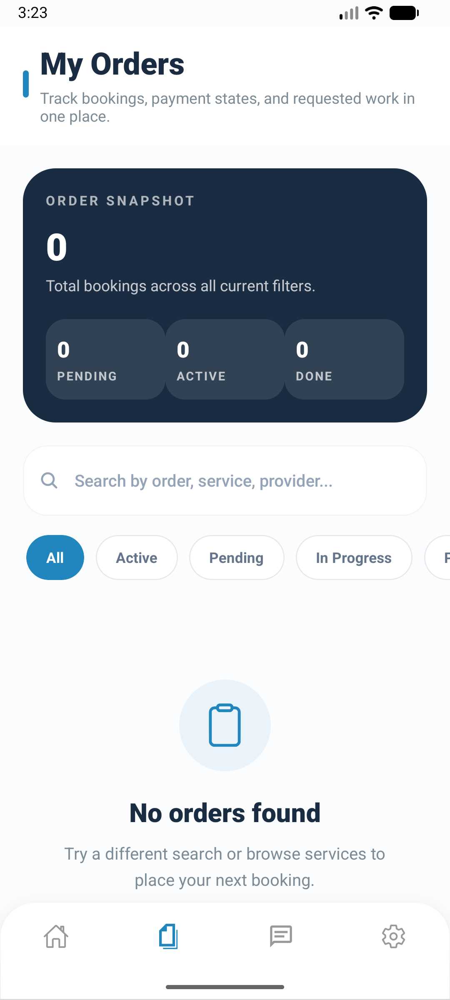
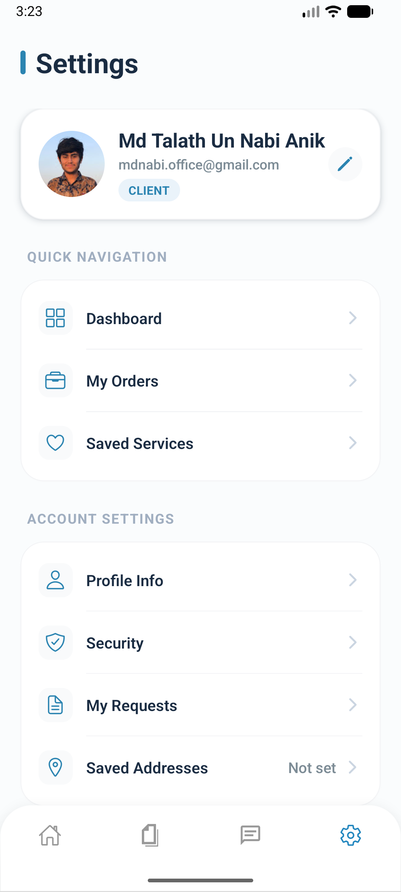

# Jacob (JACO) - On-Demand Service & Gig Marketplace

Jacob is a modern, premium mobile application designed to connect clients with local and remote service providers. Built with **React Native** and **Expo**, the app delivers an interactive, real-time experience that enables clients to book services, converse, and make audio/video calls with providers directly within the app.

---

## 📱 Screenshots

Here are some previews of the Jacob app interface:

<p align="center">
  
  
  
  
  
</p>

---

## ✨ Key Features

### 👥 Dual User Experience
* **Client Mode:** Browse categories, view service providers' portfolios, book services, post custom requests, and leave ratings/reviews.
* **Provider Mode:** Setup a provider profile, define and list services, manage incoming orders/bookings, and track business operations.

### 💬 Real-Time Communication
* **Instant Text Chat:** Interactive chat screens with socket-based instant messaging.
* **Voice & Video Calling:** Fully-integrated WebRTC-based high-quality audio and video calling directly from chat threads.

### 🗺️ Geolocation & Map Integration
* Browse services near your location using Mapbox API coordinates.
* Location access permissions handling for native platforms.

### 🔑 Secure Authentication & Onboarding
* User role selection flow (Client vs. Provider) during setup.
* Secure email authentication with OTP (One-Time Password) confirmation and password resets.
* Dynamic, client-side **Google Sign-In** configured at runtime.

---

## 🛠️ Technology Stack

* **Framework:** [Expo](https://expo.dev) (SDK 54) & [React Native](https://reactnative.dev)
* **Language:** TypeScript
* **Routing:** Expo Router (File-based navigation supporting tabs, stacks, and modal screens)
* **State Management & API Querying:** Redux Toolkit & RTK Query
* **Styling:** NativeWind (Tailwind CSS v3)
* **Real-time Engine:** Socket.io Client
* **P2P Audio/Video:** WebRTC (`react-native-webrtc`) & `react-native-incall-manager`
* **Maps:** Mapbox (`expo-location`)

---

## ⚙️ Project Configuration (.env)

Create a `.env` file in the root directory of `jacob-app` containing the following environment variables:

```env
# Backend Server API and WebSocket URLs
EXPO_PUBLIC_API_URL=https://your-backend-api.ngrok-free.dev
EXPO_PUBLIC_SOCKET_URL=https://your-backend-socket.ngrok-free.dev

# Mapbox Access Token
EXPO_PUBLIC_MAPBOX_TOKEN=your_mapbox_token_here

# Google Sign-In Credentials (OAuth Client IDs)
EXPO_PUBLIC_GOOGLE_WEB_CLIENT_ID=your_google_web_client_id.apps.googleusercontent.com
EXPO_PUBLIC_GOOGLE_ANDROID_CLIENT_ID=your_google_android_client_id.apps.googleusercontent.com
EXPO_PUBLIC_GOOGLE_IOS_CLIENT_ID=your_google_ios_client_id.apps.googleusercontent.com
```

---

## 🚀 Getting Started

### Prerequisites
Make sure you have Node.js and the Expo CLI installed on your machine.

### Installation

1. **Clone the repository and navigate to the project directory:**
   ```bash
   cd jacob-app
   ```

2. **Install dependencies:**
   ```bash
   npm install
   ```

3. **Configure environment variables:**
   Duplicate the `.env.example` file and save it as `.env`, then fill in the values corresponding to your dev environment backend:
   ```bash
   cp .env.example .env
   ```

4. **Start the development server:**
   ```bash
   npm run start
   ```

5. **Run on Emulators or Native Devices:**
   * **Android:** Press `a` in the terminal or run `npm run android`.
   * **iOS:** Press `i` in the terminal or run `npm run ios`.
   * **Expo Go:** Scan the QR code with the Expo Go app (Note: Native modules like WebRTC and Google Sign-In will require a custom Development Client build).

---

## 📂 Project Structure

```text
jacob-app/
├── app/                  # Expo Router directory (App navigation, screens and tabs)
│   ├── (auth)/           # Authentication flow (Login, Register, OTP, Onboarding)
│   ├── (profile)/        # Profile-related workflows
│   ├── (provider)/       # Provider workflows
│   ├── (provider-setup)/ # Onboarding setup for service providers
│   ├── (provider-tabs)/  # Tab views for service providers (Dashboard, Orders, Services)
│   ├── (tabs)/           # Tab views for clients (Home, Bookings, Messages, Settings)
│   └── _layout.tsx       # Root layout entry point
├── assets/               # Local media, icons, and static assets
├── screenshots/          # App preview screenshots
├── src/
│   ├── components/       # Custom reusable UI components
│   ├── contexts/         # React context providers (Auth context, etc.)
│   ├── lib/              # API Clients, env parsers, helper libraries
│   └── store/            # Redux store and API slices
├── app.json              # Expo application configuration (App name, version, icons, plugins)
├── package.json          # Dependency listings and project scripts
└── tsconfig.json         # TypeScript compiler configurations
```
