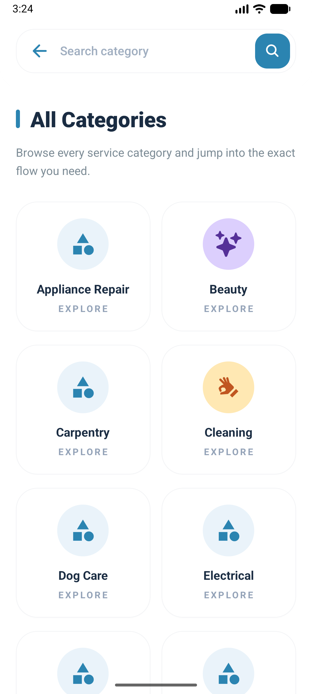
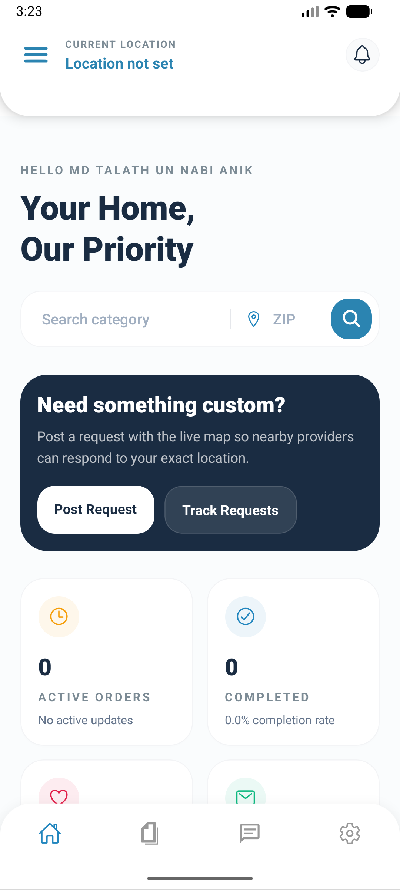

# Jacob Backend API & Real-Time Engine

[](https://nodejs.org/)
[](https://expressjs.com/)
[](https://www.mongodb.com/)
[](https://socket.io/)
[](https://stripe.com/)
[](../LICENSE)

The **Jacob Backend** is a high-performance RESTful API and WebSocket engine supporting the Jacob On-Demand Service & Gig Marketplace platform. Built with **Node.js**, **Express 5**, **MongoDB (Mongoose)**, and **Socket.io**, it provides complete authentication, real-time messaging, WebRTC signaling, order payment escrow processing via Stripe, Cloudinary media handling, and automated background jobs.

---

## 📱 Mobile & Web App Previews

The backend powers both the Mobile Application and Web Portal:

<p align="center">
  
  
  
  
  
</p>

---

## 🛠️ Technology Stack & Dependencies

* **Framework & Core:** Express.js 5, Node.js
* **Database:** MongoDB with Mongoose ODM
* **Real-time Server:** Socket.io (WebSocket chat & WebRTC P2P signaling)
* **Authentication:** JSON Web Tokens (`jsonwebtoken`), `bcryptjs` password hashing, Google OAuth (`google-auth-library`)
* **Email Service:** Nodemailer (SMTP OTP delivery for registration and password resets)
* **Storage & Uploads:** Cloudinary API & Multer for avatar, portfolio, and chat attachment media storage
* **Payments:** Stripe API (`stripe`) for checkout sessions and webhook processing
* **Background Jobs:** Node-cron for order reminders, auto-completion, and cleanup

---

## ⚙️ Environment Configuration

Create a `.env` file in the `backend` directory based on `.env.example`:

```env
PORT=5001
MONGODB_URI=mongodb://127.0.0.1:27017/jacob
CORS_ORIGIN=http://localhost:3000,http://localhost:3001
SOCKET_CORS_ORIGIN=http://localhost:3000,http://localhost:3001

# Authentication Secrets & Expiry
JWT_SECRET=replace_with_a_secure_secret
JWT_EXPIRES_IN=15m

# SMTP Email Configuration (Nodemailer OTP)
SMTP_HOST=smtp.gmail.com
SMTP_PORT=587
SMTP_SECURE=false
SMTP_USER=your_email@example.com
SMTP_PASS=your_app_password
SMTP_FROM=your_email@example.com

# Cloudinary Setup (Media Uploads)
CLOUDINARY_CLOUD_NAME=your_cloud_name
CLOUDINARY_API_KEY=your_cloudinary_api_key
CLOUDINARY_API_SECRET=your_cloudinary_api_secret

# Initial SuperAdmin Setup
ADMIN_EMAIL=admin@admin.com
ADMIN_PASSWORD=1234
ADMIN_FIRST_NAME=Admin
ADMIN_LAST_NAME=User

# Stripe Payment Gateway
STRIPE_SECRET_KEY=replace_with_your_stripe_secret_key
STRIPE_WEBHOOK_SECRET=replace_with_your_stripe_webhook_secret
CLIENT_APP_URL=http://localhost:3000
ADMIN_APP_URL=http://localhost:3001
STRIPE_CURRENCY=usd
```

---

## 🚀 Getting Started

### Installation

1. **Navigate to the backend directory:**
   ```bash
   cd backend
   ```

2. **Install dependencies:**
   ```bash
   npm install
   ```

3. **Configure Environment File:**
   Copy `.env.example` to `.env` and fill in your MongoDB URI, JWT secret, and SMTP credentials.

4. **Run in Development Mode:**
   ```bash
   npm run dev
   ```

5. **Run in Production Mode:**
   ```bash
   npm start
   ```

*Base Server URL:* `http://localhost:5001`

---

## 🔑 Database Auto-Seeding

Upon initial database connection, the server automatically executes `ensureSuperAdmin()` to seed the system SuperAdmin user account specified in `.env` if one does not already exist.

---

## 📡 API Reference & Endpoints

### 1. Authentication & Security (`/api/auth`)

| Method | Endpoint | Description | Auth Required |
| :--- | :--- | :--- | :--- |
| `POST` | `/api/auth/signup` | Send OTP email verification for new account | No |
| `POST` | `/api/auth/verify-signup-otp` | Verify 4-digit OTP and activate account | No |
| `POST` | `/api/auth/login` | Account login (Returns JWT Access & Refresh Tokens) | No |
| `POST` | `/api/auth/google` | Sign-in or sign-up via Google OAuth ID Token | No |
| `POST` | `/api/auth/refresh-token` | Refresh expired access token using refresh token | No |
| `POST` | `/api/auth/logout` | Revoke refresh token & log out | Yes |
| `POST` | `/api/auth/forgot-password` | Send password reset OTP email | No |
| `POST` | `/api/auth/reset-password` | Confirm OTP and reset password | No |

---

### 2. User & Provider Profiles (`/api/profile`)

| Method | Endpoint | Description | Auth Required |
| :--- | :--- | :--- | :--- |
| `GET` | `/api/profile` | Get current user profile details | Yes |
| `PUT` | `/api/profile` | Update profile information, skills, bio, rate, avatar | Yes |

---

### 3. Gigs & Service Listings (`/api/gigs`)

| Method | Endpoint | Description | Auth Required |
| :--- | :--- | :--- | :--- |
| `GET` | `/api/gigs` | List and search gigs with category, tag, price filters | No |
| `GET` | `/api/gigs/:id` | Get detailed information for a single gig | No |
| `POST` | `/api/gigs` | Create a new gig listing (Provider only) | Yes |
| `PUT` | `/api/gigs/:id` | Edit an existing gig listing | Yes |
| `DELETE` | `/api/gigs/:id` | Delete a gig listing | Yes |
| `GET` | `/api/gigs/provider/my-gigs` | Fetch all gigs published by the logged-in provider | Yes |

---

### 4. Categories (`/api/categories`)

| Method | Endpoint | Description | Auth Required |
| :--- | :--- | :--- | :--- |
| `GET` | `/api/categories` | Retrieve list of all service categories & subcategories | No |
| `POST` | `/api/categories` | Create a new category (Admin only) | Yes (Admin) |

---

### 5. Orders & Payments (`/api/orders`)

| Method | Endpoint | Description | Auth Required |
| :--- | :--- | :--- | :--- |
| `POST` | `/api/orders` | Create an order & initiate Stripe payment checkout | Yes |
| `POST` | `/api/stripe/webhook` | Stripe webhook endpoint for payment confirmation | Public (Raw body) |
| `GET` | `/api/orders` | Fetch user orders (Filtered by client/provider role) | Yes |
| `GET` | `/api/orders/:id` | Fetch specific order details | Yes |
| `PATCH` | `/api/orders/:id/status` | Update order progress status | Yes |
| `POST` | `/api/orders/:id/deliver` | Provider submits completed work/deliverables | Yes |
| `POST` | `/api/orders/:id/complete` | Client accepts deliverable & completes order | Yes |
| `POST` | `/api/orders/:id/review` | Client submits rating & review for completed order | Yes |

---

### 6. Custom Service Requests (`/api/service-requests`)

| Method | Endpoint | Description | Auth Required |
| :--- | :--- | :--- | :--- |
| `GET` | `/api/service-requests` | List custom service requests posted by clients | Yes |
| `POST` | `/api/service-requests` | Client creates a custom job request | Yes |
| `POST` | `/api/service-requests/:id/proposals` | Provider submits a proposal for a request | Yes |

---

### 7. Real-Time Chat & Messaging (`/api/chats`)

| Method | Endpoint | Description | Auth Required |
| :--- | :--- | :--- | :--- |
| `GET` | `/api/chats` | Retrieve active chat threads for logged-in user | Yes |
| `GET` | `/api/chats/:id/messages` | Retrieve message history for a specific thread | Yes |
| `POST` | `/api/chats/:id/messages` | Send message or attachment in chat thread | Yes |

---

### 8. Notifications, Support & Withdrawals

| Endpoint | Method | Description |
| :--- | :--- | :--- |
| `/api/notifications` | `GET`, `PATCH` | Manage user activity notifications |
| `/api/withdrawals` | `GET`, `POST` | Provider earnings withdrawal requests |
| `/api/support` | `GET`, `POST` | Dispute resolution and customer support tickets |
| `/api/faqs` | `GET` | Frequently Asked Questions list |
| `/api/website-reviews` | `GET` | Testimonial reviews for landing showcase |

---

## ⚡ WebSocket Events & WebRTC Signaling

Socket.io runs alongside the HTTP server on port `5001`.

### Supported Socket Events:
* **`connection` / `disconnect`:** Connection lifecycle management.
* **`join_room`:** Join a private chat room identified by `chatId`.
* **`send_message` / `receive_message`:** Instant chat message broadcasting.
* **WebRTC Video/Voice Calling Events:**
  * `webrtc_offer`: Relays WebRTC SDP offer from caller to receiver.
  * `webrtc_answer`: Relays WebRTC SDP answer back to caller.
  * `webrtc_ice_candidate`: Transmits ICE candidates for P2P connection establishment.
  * `end_call`: Terminates active call session.

---

## 📂 Project Architecture

```text
backend/
├── src/
│   ├── config/             # DB connection setup (MongoDB)
│   ├── controllers/        # Express route request handlers
│   │   ├── authController.js
│   │   ├── categoryController.js
│   │   ├── chatController.js
│   │   ├── gigController.js
│   │   ├── notificationController.js
│   │   ├── orderController.js
│   │   ├── profileController.js
│   │   ├── serviceRequestController.js
│   │   ├── supportController.js
│   │   └── withdrawalController.js
│   ├── jobs/               # Background cron tasks (order reminders & auto-complete)
│   ├── middlewares/        # Authentication, Validation, Error Handling
│   ├── models/             # Mongoose schemas (User, Gig, Order, Chat, Message, etc.)
│   ├── routes/             # Express API route modules
│   ├── socket/             # Socket.io handlers & WebRTC signaling logic
│   ├── utils/              # Helper utilities (OTP generator, Email sender, Cloudinary, SuperAdmin check)
│   ├── app.js              # Express app middleware configuration and route binding
│   └── server.js           # HTTP server initialization and database connection entry point
├── uploads/                # Local static file upload storage
├── .env.example            # Environment variables template
├── package.json            # Dependencies and npm script declarations
└── README.md               # Backend documentation
```

---

## 🔒 License & Copyright

This project is proprietary software licensed under **Commercial "All Rights Reserved" (Maximum Proprietary Protection)**.

Copyright (c) 2026 Jacob (JACO). All rights reserved. Unauthorized copying, distribution, or modification is strictly prohibited. For details, see the main [`LICENSE`](../LICENSE) file.
